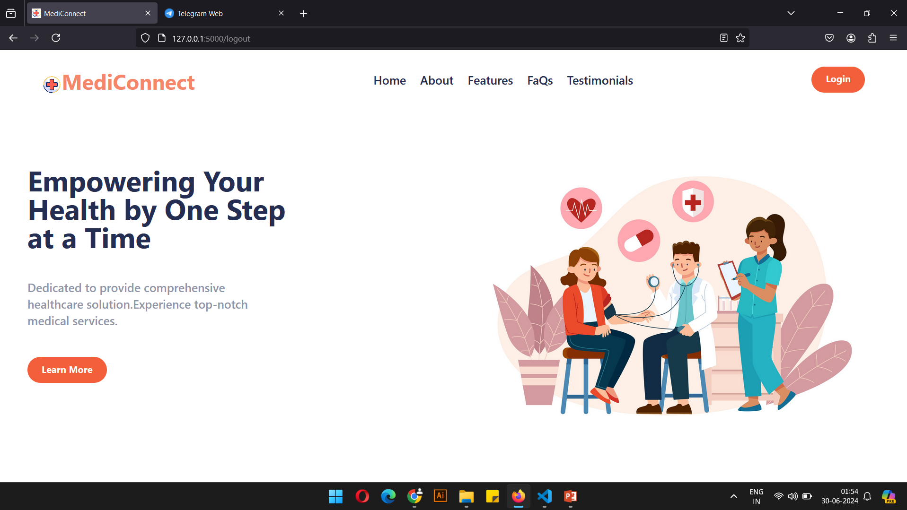

# MediConnect



Health concerns often don't follow a schedule, and may knock at the door anytime and anywhere. But early detection and proper medication can prevent these concerns from becoming severe problems. Let’s understand this with the help of an example- Parkinson's disease is a progressive nervous system disorder common in aged people that affects movement. It develops gradually, sometimes starting with a barely noticeable tremor in just one hand. While tremors are common, the disorder also commonly causes stiffness or slowing of movement. Parkinson's disease symptoms worsen as your condition progresses over time and there is no cure for this. But it can be cured if it is detected at an early stage. So here comes our web application MediConnect that provides comprehensive healthcare services available 24/7, ensuring you can manage your health anytime, anywhere.<br>


## Features
* 1. Healthy Parameter Tracking <br>
Keep a close eye on your health with our comprehensive tracking tools. Monitor key parameters like blood pressure, heart rate, and more. Empower yourself with the data you need to make informed decisions about your well-being.

* 2. Medicine Timer & Management <br>
Never miss a dose with our intuitive Medicine Timer. Set reminders for all your medications and receive timely notifications to ensure you stay on track with your treatment plan.

* 3. Medical Chatbot & AI Technology<br>
Get instant medical advice and support with our 24/7 Medical Chatbot. Whether you have a question about symptoms, need guidance on medication, or want to know when to seek professional help, our AI-driven chatbot is here to assist you with reliable information and personalized suggestions.


## Installation

1. Clone this repository:

    ```bash
    git clone https://github.com/your_username/rag-application.git
    cd rag-application
    ```

2. Install dependencies:

    ```bash
    pip install -r requirements.txt
    ```
  
3. Run the application:<br>
    Run app.py and bot.py 
